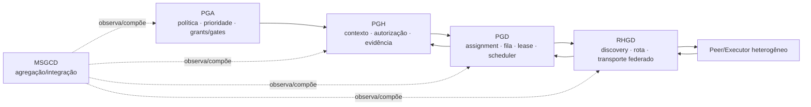

# U-RHGD-08 — conciliação RHGD com os protocolos vivos da suíte

A U-RHGD-07 permanece evidência histórica imutável. Esta unidade não a reescreve: acrescenta uma reconciliação incremental contra os contratos fechados posteriores e mantém a RHGD `0.0.1` em **STANDBY_CANDIDATE**.

## Fronteira canônica preservada

**PGA governa; PGH contextualiza/autoriza; PGD agenda/executa; RHGD federa; MSGCD agrega.**

RHGD não recebe admission, fila, assignment, lease, scheduler, retry, recovery, watermark ou estado runtime. O `FederatedDestinationMatcher` continua um matcher de candidatos: `authority_effect=NONE`. O alias histórico `CognitiveScheduler` não volta a significar scheduler.

## Delta desde U-RHGD-07

| Fonte fechada consumida | O que RHGD concilia | O que não muda |
|---|---|---|
| **PGD U14** — `pgd-incremental-information-exchange/1` | consulta/resposta pode atravessar zona heterogênea por referência/federação RHGD | WCB, fila, lease, retry, watermark e runtime continuam PGD; resposta é evidência, não autoridade |
| **PGA U08** — `pga-network-service-agents/1` | RHGD é `network_federation_owner`; join é explícito e private-by-default | os dois agentes efêmeros são materializados pelo runtime owner PGD; PGA não cria runtime |
| **PGA U09** — `pga-deterministic-priority-policy/1` | rotas/candidatos RHGD podem carregar observações para a eleição superior | P0–P4 não concedem autoridade, não furam lease/fence e não criam preempção automática |
| **PGH U278** — safe point fechado pós-U268/U269 | RHGD fornece candidatos/rotas/capacidades observadas; autorização/contexto/evidência continuam PGH | U282 ativo não é consumido no meio da unidade; apenas o safe point fechado U278 é pinado |
| **Control Plane U250/U280** — `pgh-context-sync/1` | `federation=RHGD`, com safe point, capability e base revision | `policy=PGA`, `semantic=PGH`, `runtime=PGD`, `integration=MSGCD`; nenhum broker/scheduler paralelo |

MSGCD permanece composição de integração/visão agregada; não é repositório/runtime obrigatório nem quarta autoridade.

## Política de rede conciliada

A política PGA U08 fixa o que a RHGD deve obedecer antes de qualquer materialização real:

1. escopo padrão privado;
2. adesão à rede somente explícita;
3. nenhum recurso privado é compartilhado implicitamente;
4. compartilhamento adicional exige grant explícito;
5. após join, existem exatamente os papéis efêmeros `network_control_agent` e `distributed_processing_agent`;
6. a federação de rede pertence à RHGD, mas a materialização e execução desses agentes pertencem ao PGD.

## O que está provado e o que ainda não está

A federação **contratual** está conciliada: o adapter `pgd-rhgd-federation/1`, as fronteiras de autoridade, o matcher federativo local e o transporte heterogêneo por referência têm contratos e testes. Isso não equivale a rede viva.

O `NodeCapability` atual é um snapshot em memória e o adapter HMM é read-only. Portanto **capability discovery vivo continua `NOT_VERIFIED`**. Não há, nesta unidade, dois peers reais autenticados anunciando capacidade/freshness, nem prova de reconnect/failover end-to-end. Por isso **federação/rede real continua `NOT_VERIFIED` e produção continua `BLOCKED`**.

TEE/attestation e adapters upstream continuam opcionais nesta etapa. Eles não são usados para fabricar maturidade: só entram como gates obrigatórios se uma futura decisão/contrato os tornar requisitos de produção.

## Gates mínimos antes de sair de STANDBY_CANDIDATE

A promoção futura precisa provar, em ambiente real e por canal independente: discovery vivo entre ao menos dois peers; rede autenticada; preservação end-to-end de assignment/lease/fence PGD; join/grants privados por padrão; reconnect/idempotência; proveniência de resultado; zero exposição de segredo; freshness/stale rejection; e observabilidade independente. Até isso ocorrer, o estado correto é candidato, não produção com ressalva.

## Diagrama conciliado

A seta PGD→RHGD transporta trabalho já autorizado/contratado; ela não transfere o scheduler. A volta RHGD→PGD traz resultado/proveniência observada para o runtime e depois para homologação semântica PGH.
